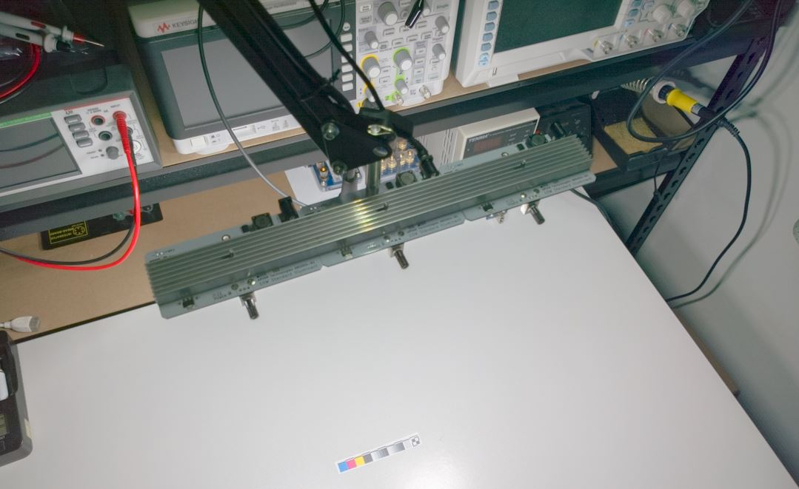

# AR0004-R1
PCB design files for 10W D50/D65 (5000K/6500K ANSI approximate) standard illuminant modular LED panels. Note any 3528 PLCC LED will suffice provided forward voltage and maximum current are accounted for.

### Design Notes:
* Potentiometer mounts on LED side of PCB, reverse pins and deadzone resistor in schematic for opposite mounting
* Thermal design of PCB heatsinking for LEDs is insufficient to cool LEDs to a temperature to prolong life, external heatsink & active cooling required for operation at 10W.
* A diffusor is recommended to reduce intensity of reflections and ease eye strain. Folded printer paper can suffice but will reduce efficiency and minorly affect colour point/spectral content.

### Related Videos
* _**'SMT Design Mistakes'**_: [https://youtu.be/_iIPJBWDUq0](https://youtu.be/_iIPJBWDUq0) discusses heat conduction problems related to interrupted copper areas on a typical 1 oz FR-4 PCB.

